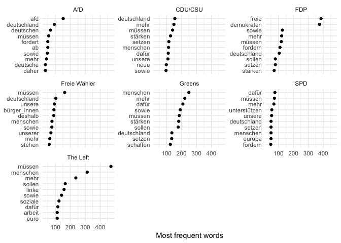

2021 German federal election manifestos
================

Repository containing manifestos of the main parties competing in the
2021 German federal elections (26 September 2021). The repository
currently contains the manifesto versions listed below.

| Party        | Description                                                                                                                  |
|--------------|------------------------------------------------------------------------------------------------------------------------------|
| AfD          | [Final version](https://cdn.afd.tools/wp-content/uploads/sites/111/2021/05/2021-05-20-_-AfD-Bundestagswahlprogramm-2021.pdf) |
| CDU/CSU      | [Final version](https://www.csu.de/common/download/Regierungsprogramm.pdf)                                                   |
| FDP          | [Final version](https://www.fdp.de/sites/default/files/2021-06/FDP_Programm_Bundestagswahl2021_1.pdf)                        |
| Freie Wähler | [Final version](https://www.freiewaehler.eu/unsere-politik/wahlprogramm/)                                                    |
| Greens       | [Final version](https://www.gruene.de/artikel/wahlprogramm-zur-bundestagswahl-2021)                                          |
| The Left     | [Final version](https://www.die-linke.de/fileadmin/download/wahlen2021/BTWP21_Entwurf_Vorsitzende.pdf)                       |
| SPD          | [Final version](https://www.spd.de/fileadmin/Dokumente/Beschluesse/Programm/SPD-Zukunftsprogramm.pdf)                        |

## Files

The repository contains the manifestos in the following formats:

-   **Original PDF files**: the folder `manifestos_originals` contains
    the manifestos published on the parties’ websites
-   **Edited PDF files**: the folder `manifestos_clean_pdf` contains
    cleaned PDF files. I removed title pages, page numbers, headers,
    footers, table of contents, and the index
-   **Text files**: the folder `manifestos_clean_txt` contains `.txt`
    files of the cleaned PDFs
-   **Corpus**: the file `data_corpus_manifestos_ger2021.rds` contains
    all party manifestos as a [**quanteda**](https://quanteda.io) text
    corpus. The corpus object also includes meta data on each variables,
    including the party codes for the [ParlGov](http://www.parlgov.org)
    and the [Manifesto Project](https://manifesto-project.wzb.eu)
    datasets.

**Note**: I [manually checked the txt files for
errors](https://github.com/stefan-mueller/data_manifestos_ger2021/commit/852923fb96c2393689fb1ccbc2ed15312517d67a)
resulting from hyphenation in the original documents. Yet, the txt files
may still contain errors. Please check the raw texts carefully before
you use them in research projects. Feel free to
[push](https://docs.github.com/en/github/collaborating-with-pull-requests/proposing-changes-to-your-work-with-pull-requests/about-pull-requests)
cleaner txt files to this repository if you adjusted texts manually. I
thank Corinna Doll for providing adjusted txt files for some of the
manifestos.

## Example

This example shows how to load the corpus object and extract the most
frequent terms in each manifesto (with minimal pre-processing and no
compounding of multiword expressions).

``` r
## Load packages
library(quanteda)
library(quanteda.textstats)
library(ggplot2)

## Load text corpus
data_corpus_manifestos_ger2021 <- readRDS("data_corpus_manifestos_ger2021.rds")

## Get summary of corpus
textstat_summary(data_corpus_manifestos_ger2021)
```

    ##       document  chars sents tokens types puncts numbers symbols urls tags
    ## 1          AfD 192214  1432  26486  6959   2940     155       2    0    0
    ## 2      CDU/CSU 347388  2656  49203  8613   6078     188       0    0    0
    ## 3          FDP 290037  2093  39577  7940   4042     113       6    0    0
    ## 4 Freie Wähler 266879  2085  37568  7602   4089      91       2    0    0
    ## 5       Greens 543449  3678  76685 12257   8735     205       1    0    0
    ## 6          SPD 186762  1494  26774  5731   3113     110       0    0    0
    ## 7     The Left 551568  4605  79424 12457   9975     445       0    0    1
    ##   emojis
    ## 1      0
    ## 2      0
    ## 3      0
    ## 4      0
    ## 5      0
    ## 6      0
    ## 7      0

``` r
## Tokenize corpus and transform to document-feature matrix
dfmat_man <- data_corpus_manifestos_ger2021 %>% 
  tokens(remove_punct = TRUE, remove_numbers = TRUE) %>% 
  tokens_compound(phrase("* *innen")) %>%  # compound *innen
  tokens_remove(pattern = c(stopwords("de"), "dass")) %>% 
  dfm()


## Get most frequent words by party
tstat_freq <- textstat_frequency(dfmat_man, 
                                 groups = party_name_short, 
                                 n = 10)

## Plot most frequent words
ggplot(data = tstat_freq, aes(x = factor(nrow(tstat_freq):1), y = frequency)) +
  geom_point() +
  facet_wrap(~group, scales = "free_y") +
  coord_flip() +
  scale_x_discrete(breaks = nrow(tstat_freq):1,
                   labels = tstat_freq$feature) +
  labs(x = NULL, y = "Most frequent words") +
  theme_minimal()
```

<!-- -->

## Citation

Feel free to use the manifestos or edited files for your own work.
Please cite the data as follows:

Stefan Müller. 2021. *2021 German federal election manifestos*. Version
0.2: <https://github.com/stefan-mueller/data_manifestos_ger2021>.

If you have any questions or suggestions, please file a [GitHub
issue](https://github.com/stefan-mueller/data_manifestos_ger2021/issues)
or [get in touch with me](https://muellerestefan.net).
